# 🏛️ JG University Landing Page

A premium, high-performance landing page for JG University, built with modern web technologies to provide an immersive experience inspired by official JG University information and branding.


## 🌐 Live Demo

The project is currently hosted and available for viewing at:
**[jg-university-landing-page-two.vercel.app](https://jg-university-landing-page-two.vercel.app/)**

## 📋 Overview

The JG University Landing Page is a modern responsive landing page designed to showcase the university's academic excellence, industry collaborations, and vibrant campus life. It features a sleek, theme-aware design (Light/Dark mode) and interactive components that engage prospective students and partners.

## ✨ Features

- **🌓 Dynamic Theming**: Fully integrated Light and Dark modes with seamless transitions and automatic system preference detection.
- **📱 Mobile-First Responsive**: Optimized for all devices, from mobile phones to high-resolution desktop monitors, using a mobile-first approach.
- **🚀 High Performance**: Built on Next.js for lightning-fast page loads and optimized asset delivery.
- **🎥 Campus Tour**: Interactive, animated image gallery featuring high-resolution assets of university facilities.
- **🎓 Program Catalog**: Comprehensive listing of courses with category-based filtering and premium card designs.
- **🤝 Industry Partners**: A seamless, glassmorphism-styled marquee showcasing official placement partners like IBM, ISRO, and TCS.
- **💬 Alumni Testimonials**: Interactive carousel with real alumni success stories and industry credentials.
- **🛠️ Admissions Guide**: Dedicated step-by-step admissions process page to guide prospective students.

## 💻 Tech Stack

- **Framework**: [Next.js](https://nextjs.org/) (App Router)
- **Styling**: [Tailwind CSS v4](https://tailwindcss.com/)
- **Animations**: [Framer Motion](https://www.framer.com/motion/)
- **Icons**: [Lucide React](https://lucide.dev/)
- **Typography**: [Google Fonts (Poppins)](https://fonts.google.com/)
- **Theme Management**: [next-themes](https://github.com/pacocoursey/next-themes)

## 🎯 Objective

This project was built to redesign and modernize the JG University website experience using modern frontend technologies and premium UI/UX practices. It serves as a demonstration of building a cohesive, high-performance web experience that aligns with a professional brand identity.

## 📸 Screenshots

|                 Light Hero                  |                 Dark Hero                 |
| :-----------------------------------------: | :---------------------------------------: |
| 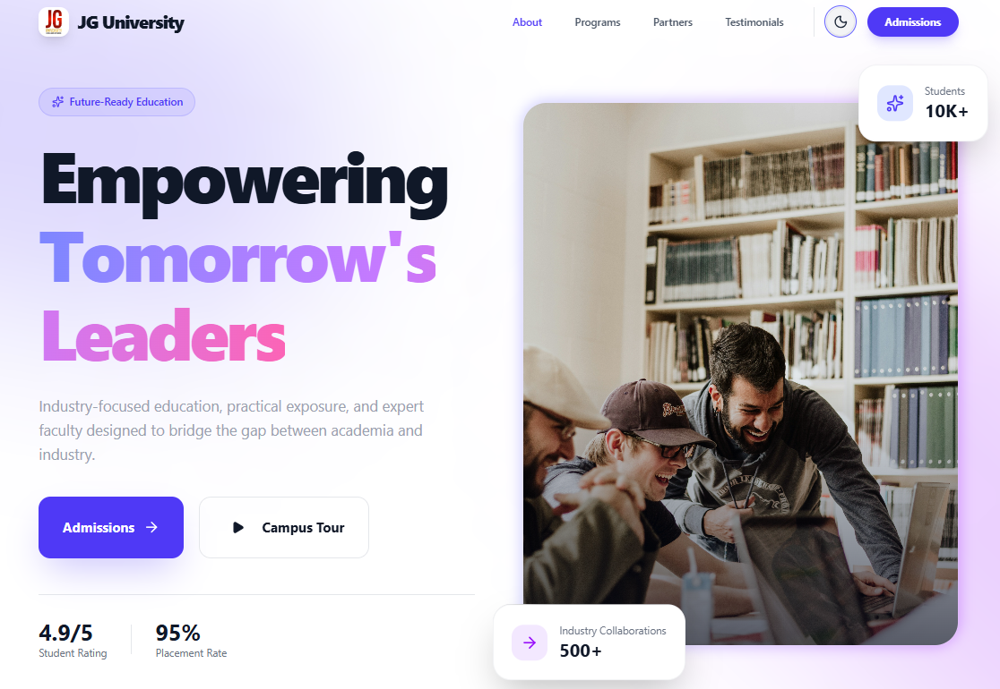 | 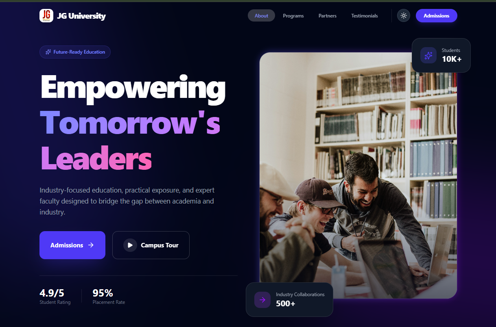 |

### Full Gallery

<div align="center">
  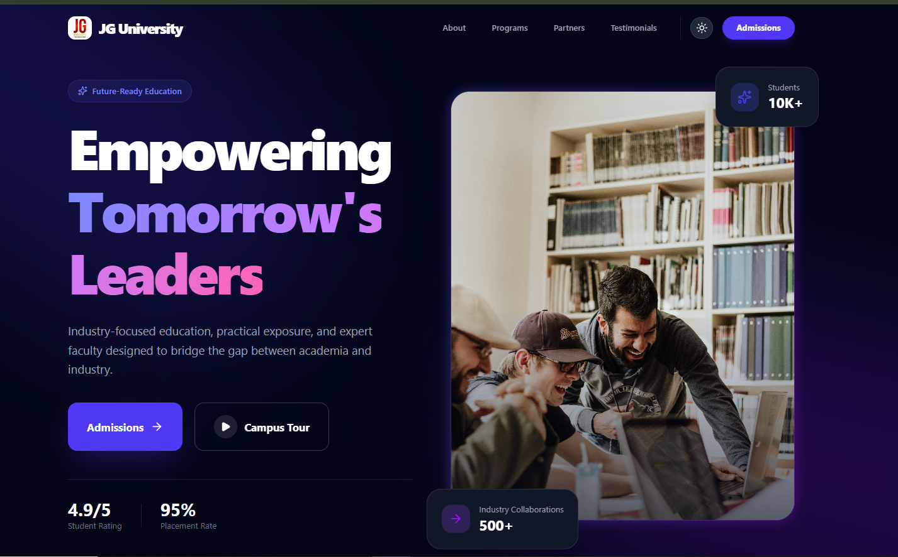
  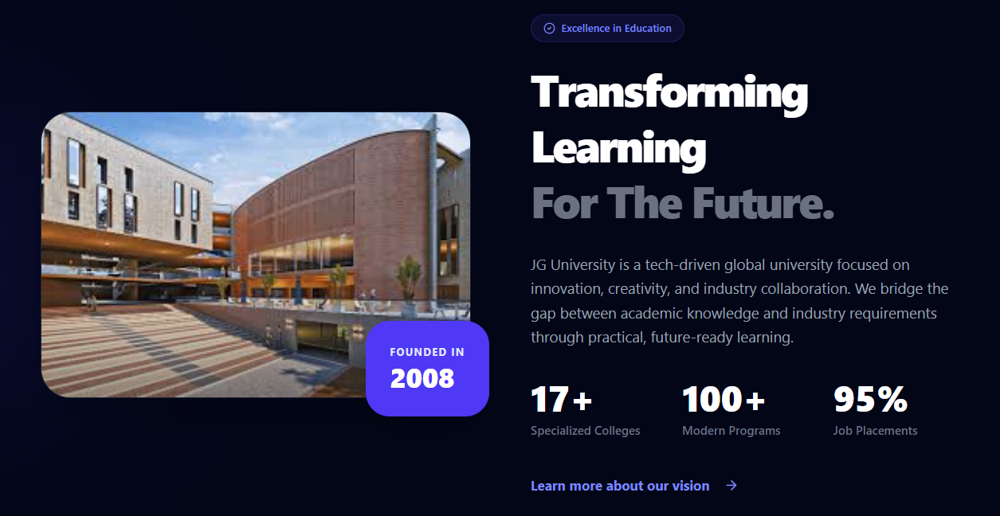
  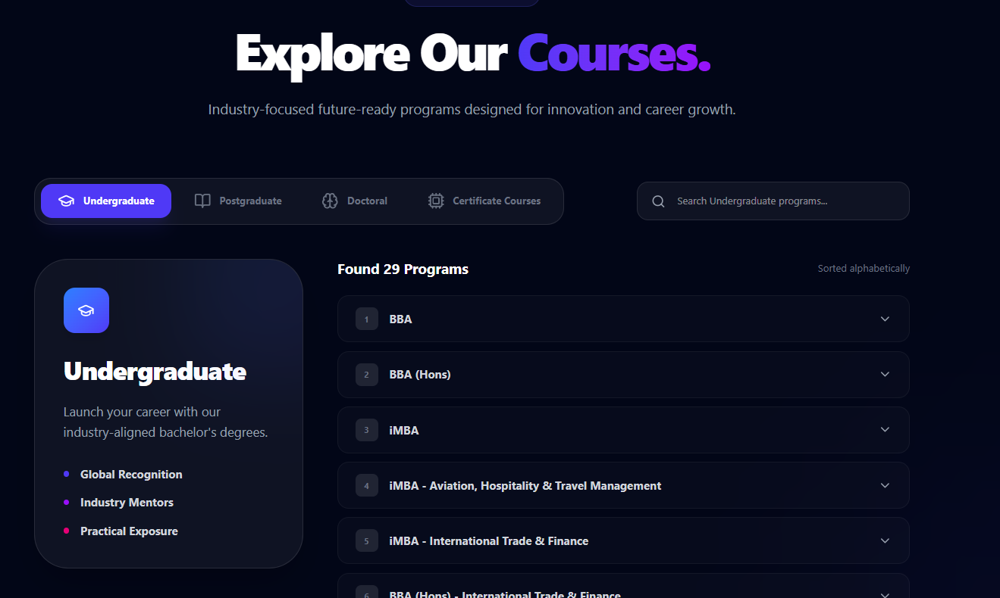
  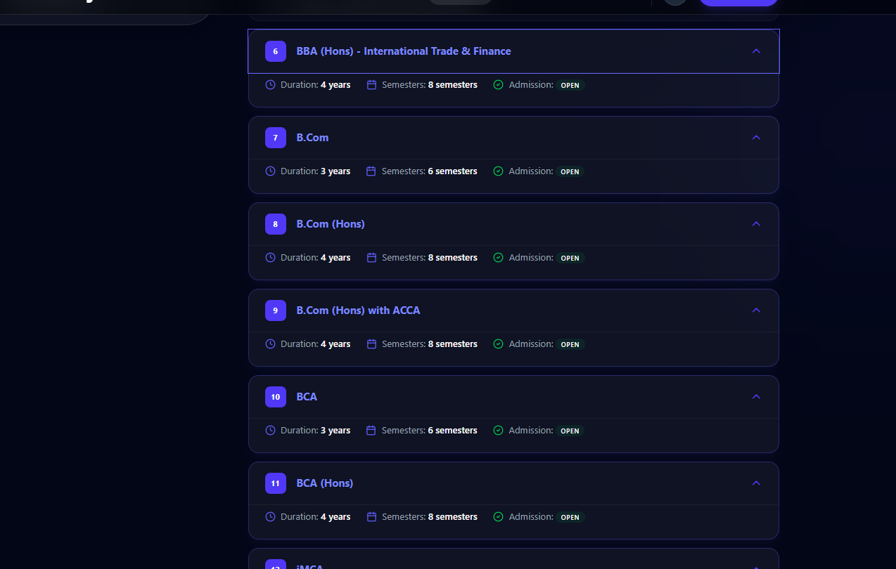
  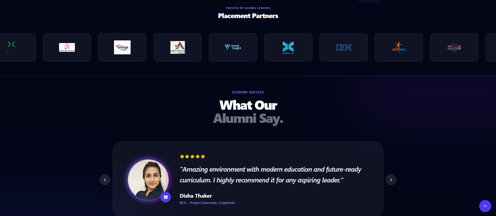
  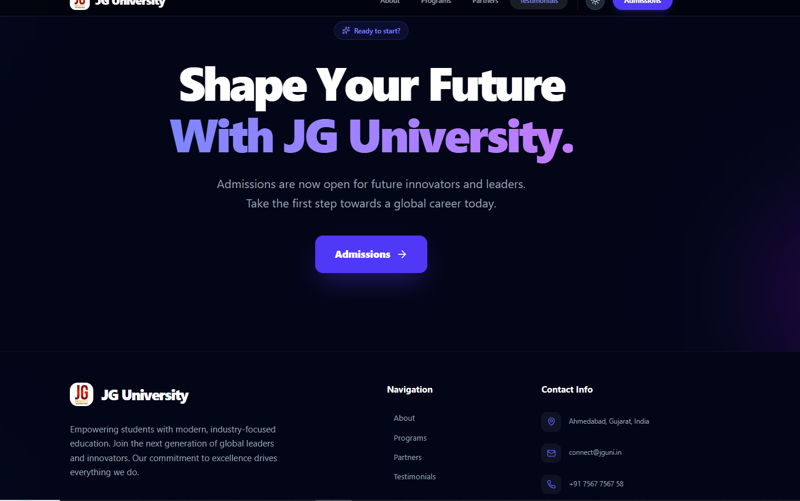
  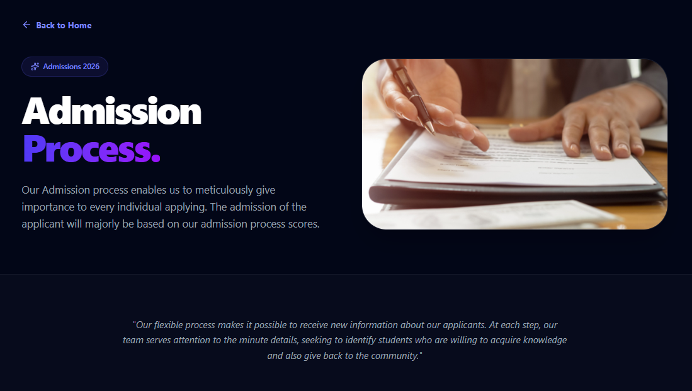
  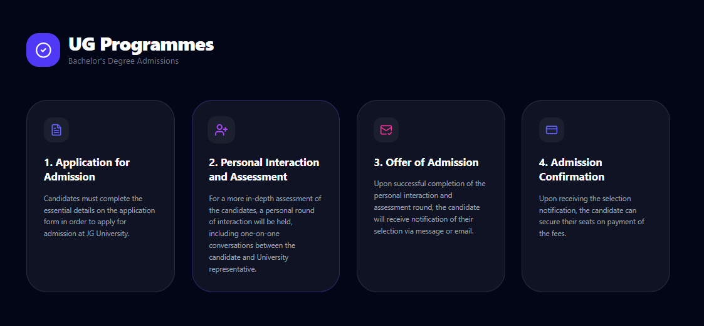
  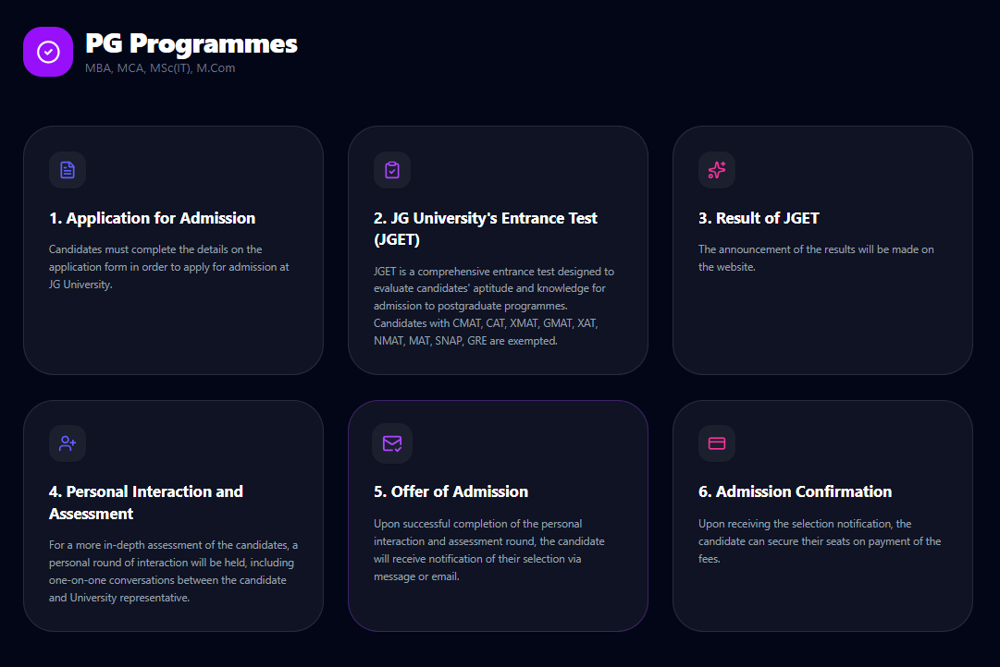
  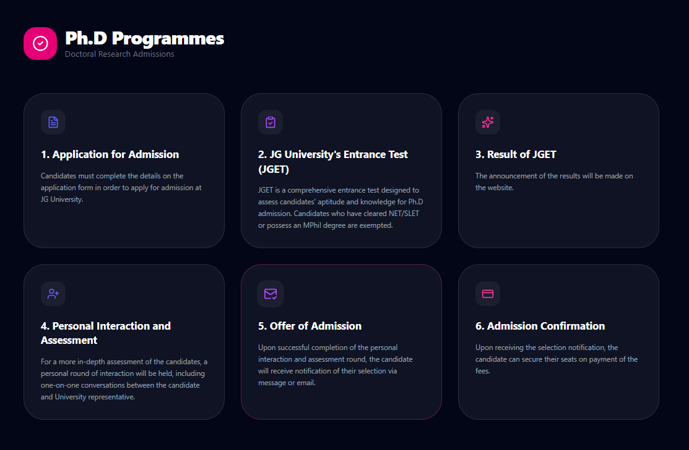
</div>

## 🛠️ Installation Steps

Follow these steps to set up the project locally:

1. **Clone the repository:**

   ```bash
   git clone git@github.com:sahilxpatel/JG-University-Landing-page.git
   cd JG-University-Landing-page
   ```

2. **Install dependencies:**

   ```bash
   npm install
   ```

3. **Run the development server:**

   ```bash
   npm run dev
   ```

4. **Build for production:**
   ```bash
   npm run build
   ```

## 📂 Folder Structure

```text
├── app/                  # Next.js App Router (Pages & Layouts)
│   ├── admissions/       # Admissions process page
│   ├── globals.css       # Tailwind v4 Global Styles
│   └── layout.tsx        # Root Layout & Metadata
├── components/           # Reusable UI Components
│   ├── Hero.tsx          # Landing Hero Section
│   ├── About.tsx         # University Overview
│   ├── Programs.tsx      # Course Catalog
│   ├── Partners.tsx      # Industry Marquee
│   ├── Testimonials.tsx  # Alumni Feedback
│   └── CampusTour.tsx    # Animated Gallery Modal
├── lib/                  # Utility functions
├── public/               # Static assets (Logos, Favicons, Screenshots)
└── tailwind.config.ts    # Tailwind Configuration
```

## 📚 Key Learnings

- **Scalable UI Components**: Developed a modular component architecture that is easy to maintain and scale.
- **Theme Architecture**: Implemented a robust theme-switching system using `next-themes` and Tailwind CSS.
- **Responsive Layouts**: Mastered mobile-first design principles to ensure a seamless experience across all screen sizes.
- **Reusable Animations**: Leveraged Framer Motion to create smooth, consistent transitions and micro-interactions.
- **UX Optimization**: Focused on performance and accessibility to deliver a premium user experience.

---

Built as a frontend redesign and learning project inspired by JG University.
